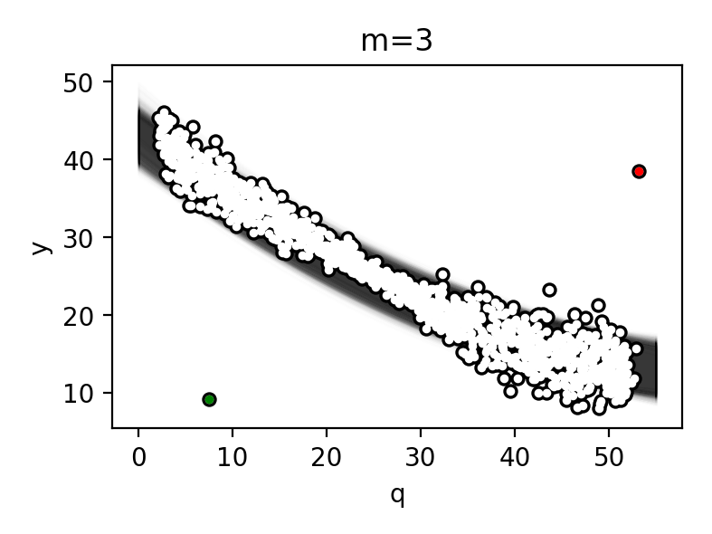
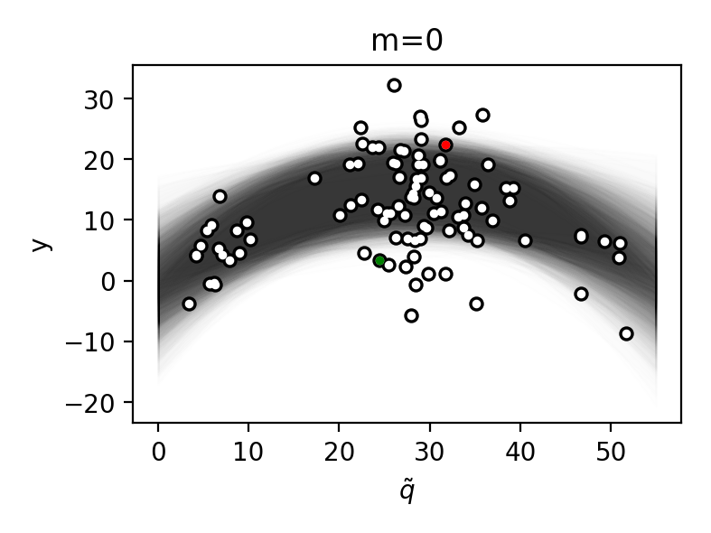
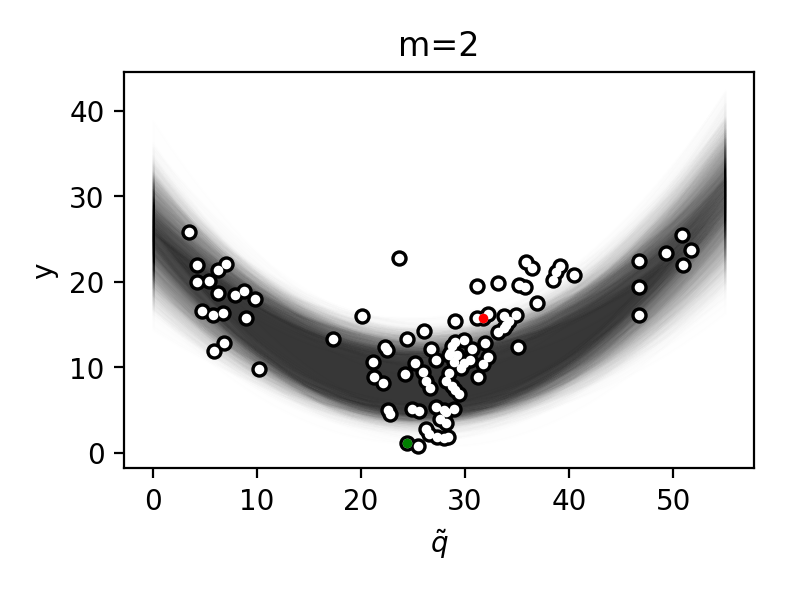

# Code for “Practical priors for reference-free error estimation” 
This is the code that was used to perform Markov chain Monte-Carlo sampling for
my article “Practical Priors for reference-free error estimation”. The purpose
of the software is to generate samples from a probability density function for a
statistical model described in the article. This software is “research quality”
i.e. a very rough prototype, I provide it as is without any warranties
whatsoever.

## Workflow

1. Install
1. Configure
1. Sample
1. Analyse

## Installation
### Clone or download
Use the “clone or download” button above the top-right corner of file list on github.
The requirements files contained in this repository contain package versions
that were used at the time of submission of the article for publication. You
might be able to obtain better results if you use newer versions of the same
packages, but there is a chance that something will break.
I recommend using conda virtual environment.
### Conda
Create and activate the virtual environment

``` bash
conda create –name pymc3
source activate pymc3
```

Install dependencies

``` bash
conda env update –file requirements.yml
```

## Sampling 


Put your measurement data into _data.csv file – observations for one case per
line. The file should not contain column headers and may use commas or space
characters as a separator.

Edit model.py to specify parameters of the priors and the degree of the bias polynomial.
Edit `sample_conf.py` to specify sampler configuration. If you want to use
analysis scripts that come with this code, please don’t change any parameters
other than the first 7. The chains are saved in pickle format every `block_size`
steps until `nsamples_per_chain` samles are generated . If desired, sampling on
any chain can be resumed by uncommenting and setting `force_chain_number` parameter.

 Run sample.py to generate MCMC samples.

``` bash
python sample.py
```

In the current implementation we sample a single chain, but you can run several
sampling processes (as opposed to threads from pymc3) in parallel. This design
was chosen because more often than not some of the chains get stuck in the local
maximum of probability and will have to be rejected (see below).

## Analysis

We include analysis scripts that were used to prepare figures for publication.
The probability density that we sample from has at least two local maxima (see
article). Unfortunately at the current state of the art there are no sampler
implementations available that are able to sample from high-dimensional
distributions efficiently, are numerically stable and mix well in the presence
of multiple local maxima of probability density, simultaneously. Because of this
we have make to a compromise. We use the NUTS sampler which is efficient for
high dimensional problems, but tends to get stuck in local maxima. To overcome
this problem we initialize multiple chains and discard the low-probability
chains during analysis using heuristics. To generate analysis files for all
chains first edit analyse_conf.py to specify the parameters of analysis,
including the burn-in period and subsampling frequence. Save this file and run
`batch_analyse.py`. If you want to run another analysis, please run
`batch_reset.py` to clear the previous results, otherwise `batch_analyse.py`
would not do anything. Default configuration of the software stores samples from
each chain into a separate subfolder with numerical name in the `traces` folder.
Running `batch_analyse.py` will add an `analysis` subfolder to each chain
folder. The `analysis` folder contains various visualizations and a
`analysis.txt` file.

### Reverse-order local maximum

The visualizations that can help with rejecting low-probability local maxima
when there is no other apparent problem have the name of the form
`‘pred_m_eq’+m+‘_trace.png’`, where m is the integer corresponding to the
measurement method number (column number in __data.csv). On these plots the $l$
and $u$ points are marked with green and red respectively. If these points alone
appear as outliers on these plots, it is a sign that the chain is stuck in the
reverse-order local maximum.



### Hybrid local maxima in higher-order bias models

I don’t have a rigorous theory for the nature of these local maxima, but they
occur fairly frequently when using quadratic or higher degree polynomials for
the bias, especially with ADVI initialization. The distribution of the expected
value of $q_p$ has a very characteristic clustering near regions of zero
predicted derivative of measurement method systematic response w.r.t $q$, and
all methods have this region in approximately the same place :





Additional signature of this situation is multiple $p$ with  bimodal marginal distribution of qp:

And non-zero random error correlation for all methods:


Depending on the data and initialization more than half of the chains may end up in such spurious local maximum, be prepared to sample more than 16 chains before arriving at a solution.
